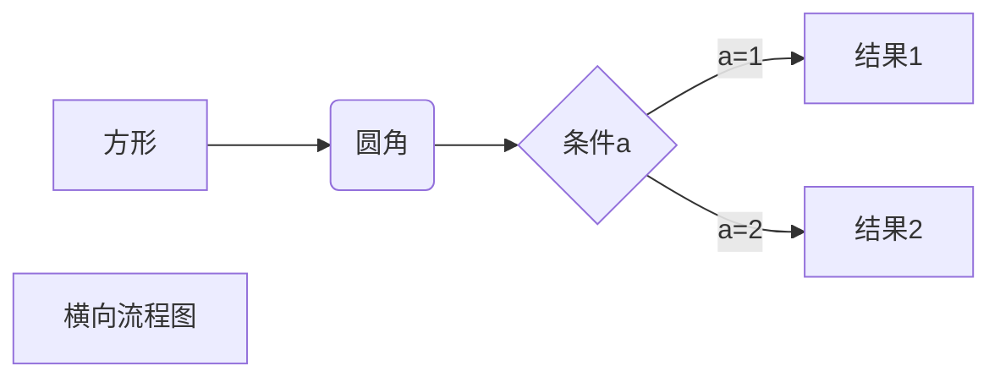

# Hello world!

我展示的是一级标题
=============

我展示的是二级标题
-----------------------------
# 一级标题
## 二级标题
### 三级标题
#### 四级标题
##### 五级标题
###### 六级标题
RUNOOB.COM  

GOOGLE.COM  

*斜体文本*

_斜体文本_

**粗体文本**

***粗斜体文本***

-----

***

___

~~BAIDU.COM~~

<u>带下划线文本</u>

[博客链接](www.baidu.com).
图片:.jpg)

创建脚注格式类似这样[^RUNOOB]

[^RUNOOB]:菜鸟教程 -- 学的不仅是技术，更是梦想！！！

* 第一项
* 第二项
1. 第一项
    * 第一项嵌套的第一个元素
    * 第一项嵌套的第二个元素
2. 第二项

> 最外层
> > 第一层嵌套
> >
> > > 第二层嵌套

> 区块中使用列表
> 1.  第一项
> 2. 第二项
> + 第一项
> + 第二项

* 第一项
    > 菜鸟教程
    > 学的不仅是技术更是梦想
* 第二项

想要写一段代码`printf`

想要写一段代码
```markdown
markdown ;
```

` printf() `  函数

```c
printf("nihao");
```

```
```matlab
clc
clear all
close all
pi = 3.1415926;
f0 = 1000;
t = linspace(0,10,11);
signal = cos(2*pi*f0*t);

```

```c++
#include<iostream>
#include<cmath>
using namespace std;
int main()
{
cout<<"what's this"<<endl;
return 0;
}


```

这个链接用1作为网址变量[Google][1]
这个链接用runoob作为网址变量[Runoob][2]
然后在文档的结尾为变量赋值（网址）

[1]:http://www.google.com/
[2]:http://www.runoob.com/


这个连接用 1作为网址变量 [RUNOOB][1].
然后在文档的结尾为变量赋值（网址）

[1]: http://static.runoob.com/images/runoob-logo.png

网址是<http://static.runoob.com/images/runoob-logo.png>

|左对齐|右对齐|居中对齐|
|--------:|:---- |:----:|
|单元格|单元格|单元格|
|单元格|单元格|单元格|


使用 <kbd>Ctrl</kbd>+<kbd>Alt</kbd>+<kbd>Del</kbd> 重启电脑


## 设置字体颜色及格式

<font font="黑体"  color=red size=12>***this is 黑体，this is red color，the size is 12***</font>

<div align=center><font color=red>文本居中</font></div>

------------------------

## 设置背景色

<table><tr><td bgcolor=yellow><font color=purple>背景色是黄色</font></td></tr></table>

## 设置图片大小及位置

<div align=center></div>

this is a netaddress<font color=black>**[another]( www.baidu.com)**</font>

## 快捷键
快捷键<kbd>ctrl</kbd>

<div align=center></div>



